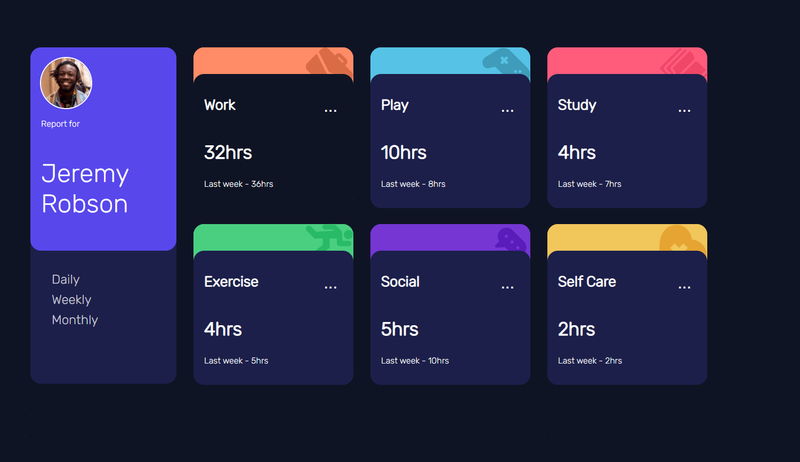

# Панели мониторинга отслеживания времени

Решая эту задачу на #frontendMentor Я закрепил работу с динамическими данными и свое понимания в работе с API. Так же изучил новую тему касающего миксинов.

## Оглавление

- [Обзор](#обзор)
  - [Вызов](#Требования-к-задаче)
  - [Скриншот](#cкриншот)
  - [Ссылки](#cсылки)
- [Мой процесс](#мой-процесс)
  - [Построен с помощью](#Построен-с-помощью)
  - [Чему я научился](#чему-я-научился)
  - [Продолжение разработки](#Продолжение-разработки)
- [Автор](#автор)
- [Благодарности](#благодарности)

## Обзор

### Требования к задаче

Пользователи должны иметь возможность:

- Просмотр оптимального макета сайта в зависимости от размера экрана их устройства
- Смотрите состояния наведения для всех интерактивных элементов на странице
- Переключение между просмотром ежедневной, еженедельной и ежемесячной статистики

  P.S стили были взяти и доработаны у работы другого участника. Мой фокус был только с JavaScript

### Скриншот



### Ссылки

- Репозитории на:[github](https://github.com/Ibrakhimzhanov/time-tracker)
- Готовый проект:[time-track](https://ibrakhimzhanov.github.io/time-tracker/)

## Мой процесс

### Построен с помощью

- Семантическая разметка HTML5
- Пользовательские свойства CSS
- API JavaScript
- Grid CSS
- Рабочий процесс, основанный на мобильных устройствах

### Чему я научился

Я придерживался, чтобы весь процесс был динамическим и в тоже время старался написать меньше, но понятный код.
Столкнулся с проблемами в работе с асинхронными запросами. Благо есть MDN в решении этих проблем помог.

```html
  <ul>
    <li id="daily">Daily</li>
    <li id="weekly">Weekly</li>
    <li id="monthly">Monthly</li>
  </ul>

```

```CSS
  :root {
    --work: hsl(15, 100%, 70%);
    --play: hsl(195, 74%, 62%);
    --study: hsl(348, 100%, 68%);
    --exercise: hsl(145, 58%, 55%);
    --social: hsl(264, 64%, 52%);
    --self-care: hsl(43, 84%, 65%);

    --blue: hsl(246, 80%, 60%);
    --very-dark-blue: hsl(226, 43%, 10%);
    --dark-blue: hsl(235, 46%, 20%);
    --desaturated-blue: hsl(235, 45%, 61%);
    --pale-blue: hsl(236, 100%, 87%);

    --f-light: 300;
    --f-medium: 400;
    --f-bold: 400;
    }
```

```js
  datas.map((data) => { 
    let lowerTitle = data.title == "Self Care" ? "self-care" :
    data.title.toLowerCase(); 
    let imgUrl = `./images/icon-${lowerTitle}.svg`;
  }

```

### Продолжение разработки

Проект сделан без адаптации. Дальше хочу сделать адаптацию и поработать с стилями. Дабы сделать максимально приближенный к дизайну.

## Автор

- Мой блок на - [hashnode](https://middleit.hashnode.dev/)
- Мой блок на - [dev.to](https://dev.to/ibrakhimzhanov)
- Frontend Mentor - [@Ibrakhimzhanov](https://www.frontendmentor.io/profile/Ibrakhimzhanov)
- Профиль на - [Linkedin](https://www.linkedin.com/in/ibrakhimzhanov/)
- Профиль 

## Благодарность

Спасибо Alenu за предоставленные стили для этого проекта😊
```
